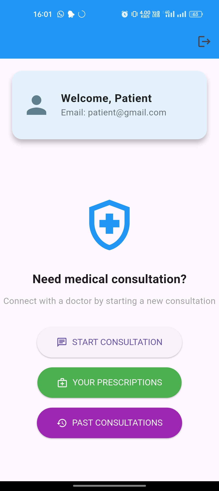
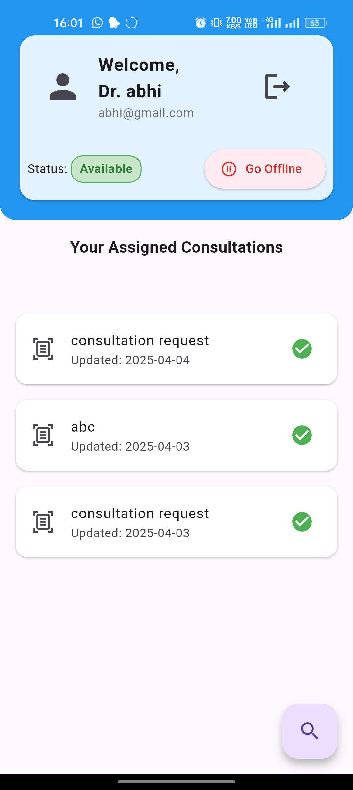
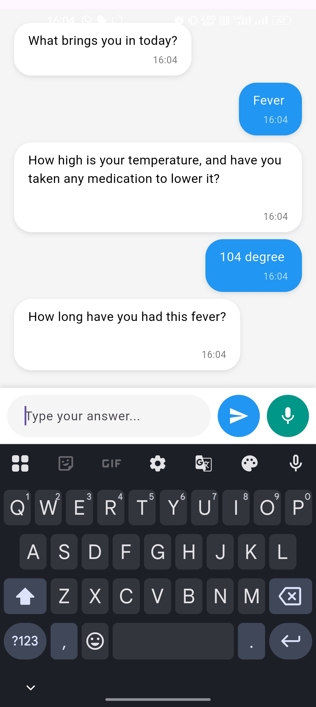
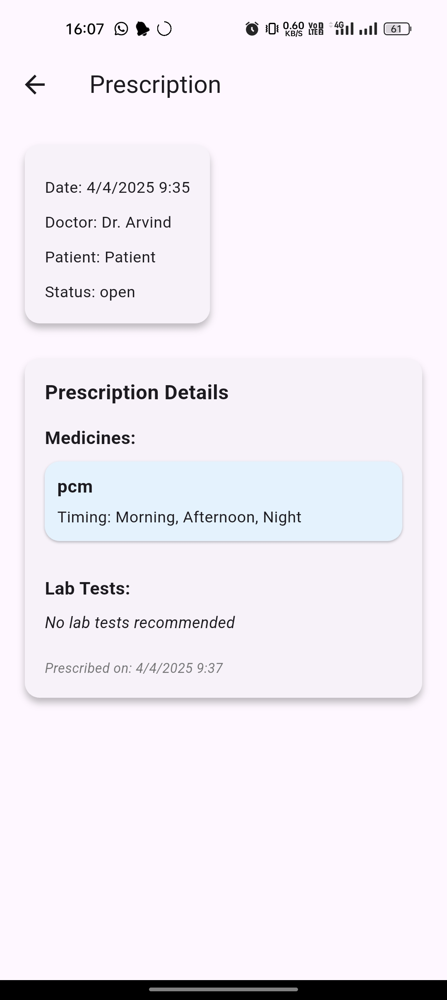

# Arogya Mitra

## Project Overview
Arogya Mitra is a Flutter-based healthcare application designed to provide an automated virtual attender for patients. It streamlines the healthcare process by enabling AI-powered diagnosis, document scanning, online doctor consultations, and medication reminders.

### Problem Solved
Many patients struggle with managing their health records, scheduling doctor consultations, and remembering medication timings. **Arogya Mitra** solves this by:
- Using AI to assess patient health issues.
- Allowing patients to upload and manage test reports easily.
- Generating an AI-based health summary for doctors.
- Enabling online video consultations with doctors.
- Setting automated medication reminders to ensure timely intake.

### Key Features
- **Automated Patient Attender** powered by Gemini API.
- **Medical Test Record Upload** via a scanner.
- **AI-Generated Health Summary** for better diagnosis.
- **Online Doctor Consultation** using Agora API for video calls.
- **Medication Reminders & Notifications** to help patients take medicines on time.

## Dependencies
To run Arogya Mitra, install the following dependencies:
- **Flutter** (Latest Stable Version)
- **Dart** (Compatible with Flutter version)
- **Agora SDK** (For video consultations)
- **Gemini API** (For AI-based interaction)
- **Scanner Plugin** (For document uploads)
- **Local Notifications Plugin** (For medicine reminders)

Ensure you have Flutter installed by running:
```bash
flutter --version
```

## Setup Instructions
1. Clone the repository:
   ```bash
   git clone https://github.com/yourusername/arogya_mitra.git
   ```
2. Navigate to the project folder:
   ```bash
   cd arogya_mitra
   ```
3. Install dependencies:
   ```bash
   flutter pub get
   ```
4. Configure environment variables (if required) for API keys.
5. Run the application:
   ```bash
   flutter run
   ```

## Usage Guide
1. Open the app and interact with the AI Attender.
2. Upload medical test reports using the scanner feature.
3. Receive a health summary generated by AI.
4. Book an online consultation with a doctor.
5. Attend the video call session via Agora.
6. Get a prescription from the doctor.
7. Receive timely reminders for taking medicine.

## Screenshots
_Add screenshots here to showcase the app’s interface and features._
<p align="center">
  
  
</p>

<p align="center">
  
  
</p>

<p align="center">
  
</p>

## Team Members
- **Adarsh** - UI-UX Developer
- **Abhishek** - Core-Developer
- **Vineet** - AI-Integration & Research
- **YashRaj** - Database-Manager

## Contribution Guidelines
We welcome contributions! Follow these steps to contribute:
1. Fork the repository.
2. Create a new feature branch.
3. Commit your changes and push to the branch.
4. Open a pull request.

## Future Plans
- Implement AI-powered symptom analysis.
- Integrate electronic health records (EHR) for doctors.
- Add multilingual support for better accessibility.

## License
This project is licensed under the **MIT License**.

## Contact
For support, reach out to **adarsh.mca23@gmail.com** or visit our repository at [GitHub](https://github.com/VinitDubey-get/arogya_mitra).

