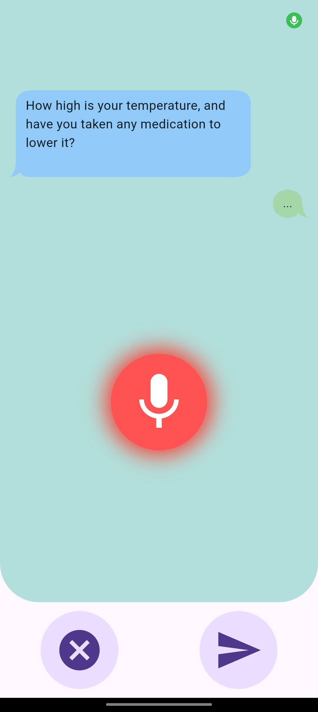

# Arogya Mitra

## Project Overview
Arogya Mitra is a AI-based healthcare application designed to ease the consultation process between doctors and patients. It streamlines the healthcare process by enabling AI-powered chatbot, online doctor consultations, and medication reminders.

## 🩺 Problem Solved

Many patients struggle with managing prescriptions, talking to doctors, and remembering medication timings — while doctors face issues like not having enough background before consultations and spending time on manual prescription tasks. **Arogya Mitra** solves these by:

- Using an AI chatbot that talks to the patient and asks questions to understand their health problem.
- Summarizing this conversation and sending it to the doctor before the video consultation.
- Helping the doctor quickly understand the patient’s condition and focus on treatment.
- Letting the doctor prescribe medicines and tests during the video call with simple clicks.
- Allowing doctors to choose medicine timings (morning, afternoon, night), which are used to automatically set reminders for the patient.
- Sending patients reminders so they take medicines on time and follow treatment properly.


### Key Features
- **Automated Patient Attender** powered by Gemini API.
- ***Medical Test Record Upload** via a scanner.
- **AI-Generated Health Summary** for better diagnosis.
- **Online Doctor Consultation** using Agora API for video calls.
- **Medication Reminders & Notifications** to help patients take medicines on time.

## 📦 Key Dependencies

Arogya Mitra uses the following major packages:

- **flutter_gemini** – AI chatbot integration using Google's Gemini API.
- **speech_to_text** & **flutter_tts** – Enables voice-based interaction with patients.
- **chat_bubbles** – Clean chat UI for patient-AI conversations.
- **firebase_core**, **firebase_auth**, **cloud_firestore**, **firebase_storage** – Backend services for authentication, data, and file storage.
- **agora_rtc_engine** – Real-time video calls for virtual doctor consultations.
- **flutter_local_notifications**, **timezone**, **hive** – Automatic medication reminders and local data storage.


## Project Setup

Ensure you have Flutter installed by running:
```bash
flutter --version
```

## Setup Instructions
1. Clone the repository:
   ```bash
   git clone https://github.com/yourusername/arogya_mitra.git
   ```
2. Navigate to the project folder:
   ```bash
   cd arogya_mitra
   ```
3. Install dependencies:
   ```bash
   flutter pub get
   ```
4. Configure environment variables (if required) for API keys.
5. Run the application:
   ```bash
   flutter run
   ```

## 📱 Usage Guide

### 👤 User Flow

1. **Login/Register**  
   - On opening the app, users land on the login screen.  
   - New users can register by providing basic information and selecting their role: **Patient** or **Doctor**.  
   - Based on the role, users are navigated to their respective dashboards.

---

### 🧑‍⚕️ Doctor Dashboard

- Doctors can:
  - Toggle their **availability** status (Available/Unavailable).
  - View a list of patients they have previously attended.
  - See **new patient requests** generated from AI-Attender conversations.
  - Review a **summary of the patient’s problem** before the call.
  - Join the **video consultation** with patient.
  - During the call, **prescribe medicines and suggest medical tests**.
  - Select **timing** for each medicine (Morning / Afternoon / Night).
  - Once the session ends, the prescription details are automatically sent to the patient, and reminders are scheduled accordingly.

---

### 🧑 Patient Flow

- Patients can:
  - Interact with the **AI Chatbot or Voice Assistant** to describe their symptoms through dynamic Q&A.
  - Request an **online consultation** with a doctor.
  - Join the **video call**.
  - After the consultation, receive a **digital prescription**.
  - Get **automatic reminders** based on the prescribed medicine and timings.


## Screenshots
<h2 align="center">📸 App Screenshots</h2>

<table align="center">
  <tr>
    <td align="center">
      <br/>
      <b>Patient Dashboard</b>
    </td>
    <td style="width: 30px;"></td>
    <td align="center">
      <br/>
      <b>Doctor Dashboard</b>
    </td>
    <td style="width: 30px;"></td>
    <td align="center">
      <br/>
      <b>Voice Consultant</b>
    </td>
    <td style="width: 30px;"></td>
    <td align="center">
      <br/>
      <b>Chat Consultant</b>
    </td>
    <td style="width: 30px;"></td>
    <td align="center">
      <br/>
      <b>Prescription Report</b>
    </td>
  </tr>
</table>

## Team Members
- **Adarsh** - UI-UX Developer
- **Abhishek** - Core-Developer
- **Vineet** - AI-Integration & Research
- **YashRaj** - Database-Manager

## Contribution Guidelines
We welcome contributions! Follow these steps to contribute:
1. Fork the repository.
2. Create a new feature branch.
3. Commit your changes and push to the branch.
4. Open a pull request.

## 🚀 Future Plans

We aim to expand **Arogya Mitra** with the following key features:

1. **Tele-Communication Support**  
   Enable access for users without smartphones or those who are not tech-savvy through basic phone-based services, ensuring inclusivity in remote areas.

2. **Doorstep Healthcare Services**  
   Integrate with local pharmacies and labs to provide **medicine delivery** and **home-based medical test collection**, offering convenience and accessibility.

3. **Patient Severity Categorization**  
   Implement AI-based patient triaging to **prioritize consultations** based on the severity of symptoms, helping doctors attend to critical cases first.


## Contact
For support, reach out to **adarsh.mca23@gmail.com**.

